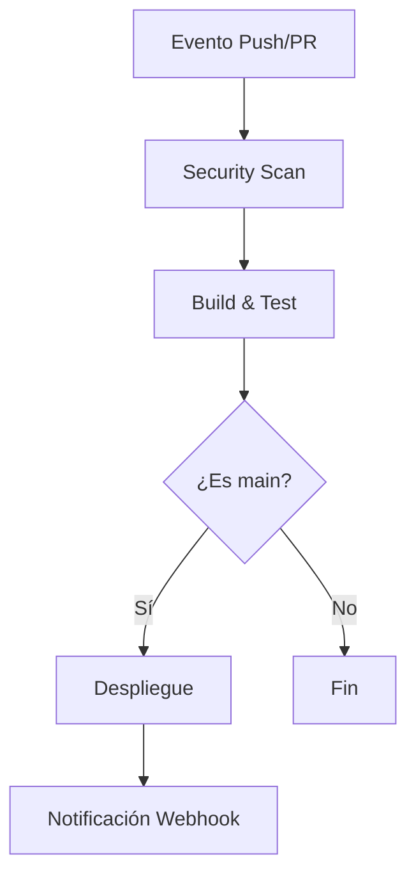

# Documentación de Configuración para MECHBOT-9000

## Configuración de Webhook

Para configurar el webhook de GitHub que notificará a tu servidor sobre eventos importantes, necesitarás reemplazar `URL_DE_TU_SERVICIO` con la URL de tu endpoint. Basado en tu configuración actual, aquí está el documento profesional detallado:

### 1. Configuración del Webhook

```bash
gh api -X POST /repos/mechmind-dwv/MECHBOT/hooks \
-f '{
  "name": "web",
  "active": true,
  "events": ["push", "pull_request", "status"],
  "config": {
    "url": "https://tuservidor.com/api/github-webhook",
    "content_type": "json",
    "secret": "$SECRET_TOKEN",
    "insecure_ssl": "0"
  }
}'
```

**Parámetros requeridos:**
- `url`: Endpoint HTTPS de tu servidor que procesará los webhooks
- `secret`: Token secreto para verificar la procedencia de los webhooks (almacenado como variable de entorno)
- `insecure_ssl`: "0" para HTTPS estricto (recomendado)

## 2. Workflow de GitHub Actions

```yaml
name: MECHBOT-9000 CI/CD Pipeline

on:
  push:
    branches: [ "main" ]
    paths-ignore:
      - 'docs/**'
      - '**.md'
  pull_request:
    branches: [ "main" ]
  workflow_dispatch:

env:
  PYTHON_VERSION: '3.12'
  SECRET_TOKEN: ${{ secrets.WEBHOOK_SECRET }}

jobs:
  security-scan:
    name: Security Scan
    runs-on: ubuntu-latest
    steps:
      - uses: actions/checkout@v4
      
      - name: Set up Python ${{ env.PYTHON_VERSION }}
        uses: actions/setup-python@v5
        with:
          python-version: ${{ env.PYTHON_VERSION }}
          
      - name: Install dependencies
        run: |
          python -m pip install --upgrade pip
          pip install -r requirements.txt
          pip install safety bandit
          
      - name: Run security checks
        run: |
          safety check --full-report
          bandit -r mechmind/
          
  build-test:
    name: Build and Test
    needs: security-scan
    runs-on: ubuntu-latest
    strategy:
      matrix:
        os: [ubuntu-latest, windows-latest]
    steps:
      - uses: actions/checkout@v4
      
      - name: Build
        run: |
          echo "Building MECHBOT-9000..."
          # Comandos de build aquí
          
      - name: Run tests
        run: |
          python -m pytest tests/ -v
          
  deploy:
    name: Deploy
    needs: build-test
    if: github.ref == 'refs/heads/main'
    runs-on: ubuntu-latest
    steps:
      - uses: actions/checkout@v4
      
      - name: Notify deployment
        run: |
          curl -X POST \
          -H "Authorization: token ${{ secrets.API_TOKEN }}" \
          -H "Content-Type: application/json" \
          -d '{"event":"deploy","ref":"${{ github.ref }}"}' \
          https://tuservidor.com/api/deploy-webhook
```

## 3. Especificaciones Técnicas

### Requisitos del Servidor Webhook
- **Endpoint**: `POST /api/github-webhook`
- **Autenticación**:
  - Verificación de firma HMAC-SHA256 usando el secret
  - Header `X-Hub-Signature-256` debe ser validado
- **Respuesta esperada**:
  - HTTP 200 para éxito
  - Body opcional para procesamiento adicional

### Estructura de Directorios Recomendada
```
MECHBOT/
├── .github/
│   └── workflows/
│       ├── ci.yml
│       └── deploy.yml
├── mechmind/
│   ├── security.py
│   └── __init__.py
├── tests/
│   ├── test_security.py
│   └── __init__.py
├── requirements.txt
└── README.md
```

### Variables de Entorno Requeridas
| Variable          | Descripción                           | Ejemplo                     |
|-------------------|---------------------------------------|-----------------------------|
| `WEBHOOK_SECRET`  | Secreto para validar webhooks        | gh_xyz123                   |
| `API_TOKEN`       | Token para API de despliegue         | ghp_abc456                  |
| `PYTHON_VERSION`  | Versión de Python objetivo           | 3.12                        |

## 4. Diagrama de Flujo



## 5. Protocolos de Seguridad

1. **Validación de Payloads**:
   ```python
   import hmac
   from hashlib import sha256

   def verify_signature(payload_body, secret_token, signature_header):
       hash_object = hmac.new(secret_token.encode(), msg=payload_body, digestmod=sha256)
       expected_signature = "sha256=" + hash_object.hexdigest()
       return hmac.compare_digest(expected_signature, signature_header)
   ```

2. **Rotación de Credenciales**:
   - Rotar tokens cada 90 días
   - Usar GitHub Actions Environments para secretos

3. **Monitorización**:
   - Configurar alerts para fallos de CI
   - Loggear todos los eventos de webhook

```bash
[ MECHBOT-9000 ]: CONFIGURACIÓN COMPLETADA | NIVEL SEGURIDAD: GAMMA
```
